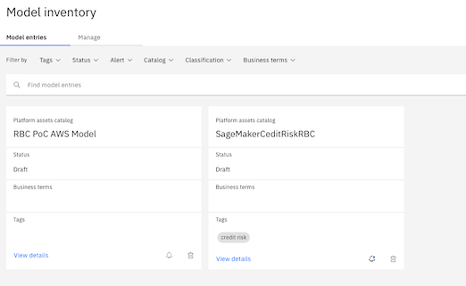
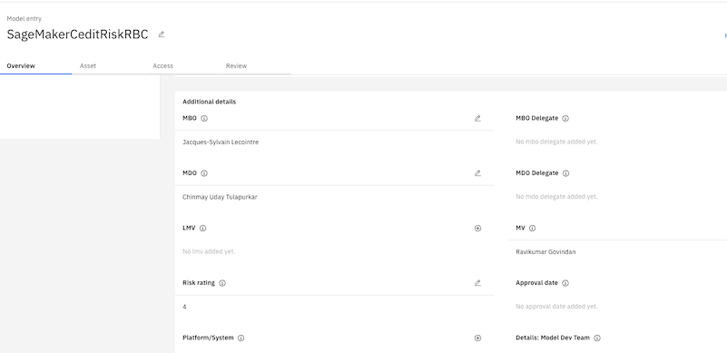
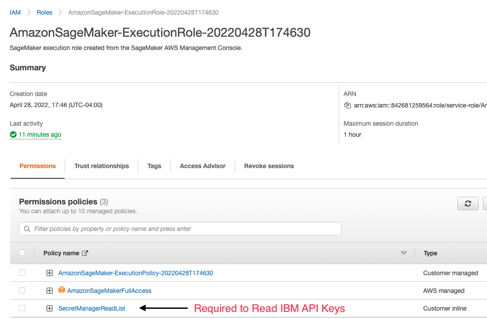
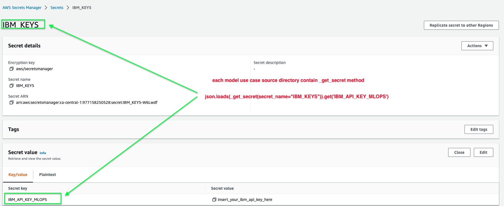

# Prerequisites

This documentation is intended to guide you through the prerequisite steps needed to install use mlmonitor

## 1. Create Cloud Object Storage

Go to your IBM Cloud Account and create a Cloud Object Storage (COS).

Also create a bucket within your COS that will serve as a storage for training datasets for Watson OpenScale configuration.

Now create service credentials for your COS (you can find this on the side panel of your cloud.ibm.com COS instance). Be sure to turn HMAC credentials **ON** which you can find under the advanced settings.

* `cos_hmac_keys.access_key_id`: This key ID can be obtained from the service credentials json of your COS.
* `cos_hmac_keys.secret_access_key`: This secret key can be obtained from the service credentials json of your COS.

## 2. Prepare Cloud Pak for Data service instances

_mlmonitor_ interacts with the following Cloud Pak for Data services :

- Watson Studio
- Watson OpenScale
- Watson Machine Learning (for future use and WML model support)
- Watson Knowledge Catalog for AI Fatcsheets (included y default with SaaS version)

## 3. Configure Factsheets service (in CP4D)

### 3.1 Enable Factsheets service for external models

All models will report metadata to AI Facsheets and will be registered either as external models (AWS or Azure) or internal models (WML).

Therefore, [external model tracking feature](https://dataplatform.cloud.ibm.com/docs/content/wsj/analyze-data/factsheet-external.html#enable-track) must be enabled by following ths link if you plan to use external models.

- You will have created a Platform Asset Catalog in WKC where external model metadata will be collected.
- Under Model *<u>Inventory => Manage</u>* , you will be able to switch **ON** the toggle for external models

  |              Platform Asset catalog              |              enable external model tracking              |
  | :--------------------------------------------: | :------------------------------------------------: |
  | |  |

### 3.2 Model inventory

- Create at least one Model use case in the Model inventory by clicking on ***New Model use case*** button , this Model use case will be used to track all the models Assets created.

  |              Add New Model use case               |              Model use case for this PoC              |
  | :--------------------------------------------: | :------------------------------------------------: |
  |  |  |

At this point you are ready you to produce facts to AI Factsheets service for external and internal models.

Ideally create one Model use case per model use case :

- Customer churn models
- Credit risk models
- MNIST models

take note of the catalog identifier and Model use case identifiers for each model use case.

### 3.3 Activate Custom facts Elements (optional)

Factsheets reports can be customized and it is possible to update the list of high level facts contained in your report.

This can be done at 2 different levels using *replace_asset_properties* function , an example can be found [here](../mlmonitor/src/factsheets/model_entry_facts.py)  :

- Model use case level is added with this [template](../mlmonitor/factsheets_churn/custom_model_entry_facts_churn.csv)
- Model facts user ( Asset tab / Additional details section of the report) added with this [template](../mlmonitor/factsheets_churn/custom_model_asset_facts_churn.csv
)

 |              Model use case custom facts              |             Model facts user custom facts       |
  | :--------------------------------------------: | :------------------------------------------------: |
  |   ! |  |


You can Update Facts Elements by running [model_entry_facts.py](../mlmonitor/src/factsheets/model_entry_facts.py) as follow :

```
# python model_entry_facts.py

INFO : Asset properties updated Successfully
INFO : Asset properties updated Successfully
```

## 4. Prepare Sagemaker environment (optional)

### 4.1 AWS credentials

- Have a **Sagemaker** environment Ready with **S3** service. You should have an IAM user created with [AmazonSageMakerFullAccess](https://us-east-1.console.aws.amazon.com/iam/home#/policies/arn%3Aaws%3Aiam%3A%3Aaws%3Apolicy%2FAmazonSageMakerFullAccess) policy .

- Under IAM => Access Management => Users , take note of AWS Access key and secret. they will be needed in _mlmonitor_ and _helm chart_ values file

### 4.2 Sagemaker execution role & Secret manager

- **Sagemaker** jobs will be executed with a Sagemaker [**ExecutionRole**](https://docs.aws.amazon.com/sagemaker/latest/dg/automatic-model-tuning-ex-role.html) that can be identified in IAM resources , add

  

  

- AWS jobs (training and inference) will need to access Factsheets service on IBM Cloud. it is recommended to store IBM API Keys in a safe place. For this project we ave stored these key in [AWS Secret Manager](https://docs.aws.amazon.com/secretsmanager/latest/userguide/intro.html).

- AWS Training jobs and Inference endpoints can fetch keys from the secret manager under secret name **IBM_KEYS**  with a default key name **IBM_API_KEY_MLOPS** therefore you should save them in this service or change the logic in training and deployment scripts :

  

  code snippet used to retrieve IBM credentials in AWS Sagemaker environment and unit test [here](../mlmonitor/tests/aws_model_use_case/test_aws_resources.py) :

```python
  import json
  from mlmonitor.src import key, secret, region
  from mlmonitor.use_case_churn.utils import _get_secret # mlmonitor.use_case_gcr.utils or mlmonitor.use_case_mnist_tf.utils
  json.loads(_get_secret(secret_name="IBM_KEYS",
                         aws_access_key_id=key,
                         aws_secret_access_key=secret,
                         region_name=region)).get('IBM_API_KEY_MLOPS')
 ```
